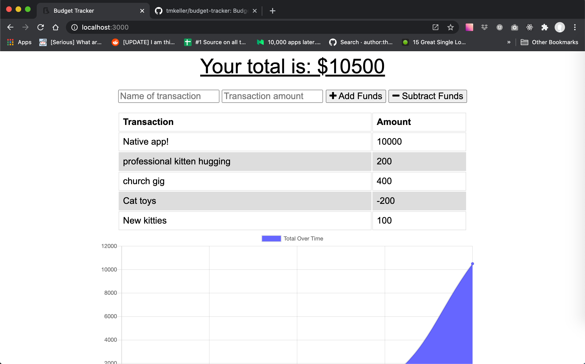
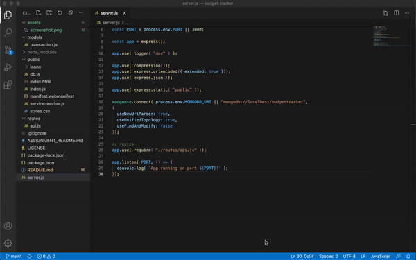

# Travel Budget Tracker

## Table of Contents
1. [Description](#description)
2. [Installation](#installation)
3. [Technologies](#technologies)
4. [Usage](#usage)
5. [Contributing](#contributing)
6. [Tests](#tests)
7. [Questions](#questions)
8. [License](#license)
## Description
An expense budget tracker for travel that uses IndexDB to work both on and offline. Downloadable as a native app! Built using compression.js, express.js, lite-server.js, mongoose.js, and morgan.js for the University of Washington's Winter 2020/21 Coding Bootcamp. Uses significant boilerplate code provided by the class admin. 

## Installation
Clone the git repository to your chosen directory. Navigate to the root of that directory using your chosen terminal/console application and type npm i to install all dependencies.

## Technologies

## Usage
Run the application by typing npm start, node server.js, or nodemon server.js (if you wish to use nodemon for a dev environment). Navigate to localhost:3000, where the app should appear. Name your transactions and enter a currency amount using the inputs at the top. You can choose whether to debit or credit them to your account with the Add Funds or Subtract Funds buttons. A download button appears in the address bar which you can use to run the budget tracker as a native app. You can open it from the URL bar from the same location.

[Live site demo](https://tmk-budget-tracker.herokuapp.com/)

## Contributing
Fork this repository on Github: https://github.com/tmkeller/budget-tracker. Contact the creator at timothy.m.keller@gmail.com about pull requests.

## Tests
No testing suite is currently designated.

## Questions
Written by [tmkeller](https://github.com/tmkeller) on Github.
Email the author at timothy.m.keller@gmail.com.

## License
[CC0](http://creativecommons.org/publicdomain/zero/1.0/)